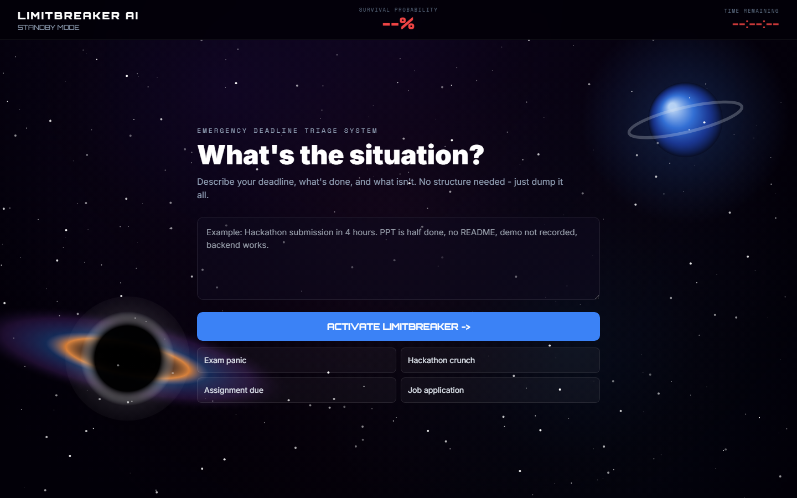
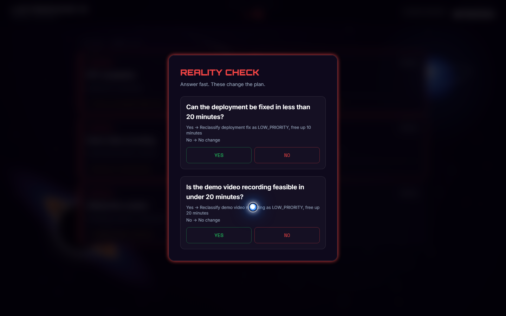
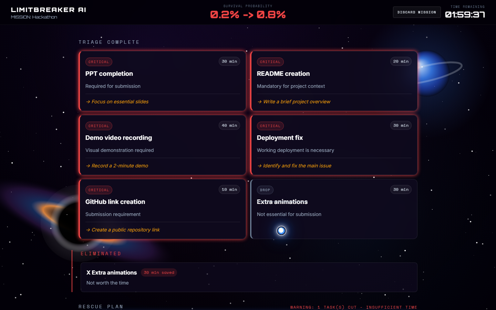

# LimitBreaker AI

Problem statement: **PS1 — The Last-Minute Life Saver**

LimitBreaker AI is an emergency deadline rescue app. It turns a messy last-minute situation into a ruthless action plan: what must be finished, what should be simplified, what should be dropped, and what to do next.

**▶ Live demo: https://limitbreaker-ai-20260629.web.app**

It is built for the moment when there is very little time left and the user needs a clear survival plan instead of generic motivation.



## ⚡ What It Does

- Reads a free-form deadline dump.
- Extracts the important tasks and constraints.
- Classifies work as `CRITICAL`, `SIMPLIFY`, or `DROP`.
- Creates a sacrifice report for eliminated work.
- Asks reality-check questions when answers could change the plan.
- Builds a timed rescue schedule.
- Tracks progress with check-ins.
- Replans if the user falls behind.
- Falls back to a Groq provider, then to offline heuristic triage, if the primary AI is unavailable.





## 🎯 Why It Is Useful

Most productivity tools assume you have enough time to plan calmly. LimitBreaker AI is for the opposite moment: the deadline is close, the work is unfinished, and the user needs to decide what survives.

Useful for hackathon submissions, assignments and reports, exam prep, job applications, demo prep — any deadline where scope has to be cut fast.

## 🚀 How To Use

1. Open the app.
2. Paste or type the situation in plain language (include the deadline, what is done, and what is unfinished).
3. Click `ACTIVATE LIMITBREAKER`.
4. Review the triage cards.
5. Answer any reality-check questions.
6. Follow the rescue schedule.
7. Use `CHECK IN NOW` if progress changes.
8. Use `Discard Mission` to reset.

Example input:

```text
Hackathon submission in 2 hours. PPT half done, README missing,
demo video not recorded, deployment failing, GitHub link needed,
extra animations are nice to have.
```

## 🛠️ Tech Stack

- React 19
- Vite 7
- Tailwind CSS
- Google AI Studio / Gemini 2.0 Flash — primary AI provider
- Groq — automatic fallback provider
- Offline heuristic fallback when both online providers fail
- localStorage for mission persistence
- HTML Canvas space background and custom pointer trail

## ⚙️ Setup

Install dependencies:

```bash
npm install
```

Create a local environment file:

```bash
cp .env.example .env.local
```

Add API keys:

```env
VITE_GEMINI_API_KEY=your_google_ai_studio_key_here
VITE_GROQ_API_KEY=your_groq_api_key_here
```

Run locally:

```bash
npm run dev
```

Open `http://127.0.0.1:5173`.

## 📜 Scripts

```bash
npm run dev      # Start the Vite dev server
npm run build    # Build the production bundle into dist/
npm run preview  # Serve the production build locally
```

## 🔥 Deploy (Firebase Hosting)

```bash
npm run build
firebase deploy
```

`firebase.json` serves the Vite `dist/` directory and rewrites all routes to `index.html`.

## 🧠 AI Flow

All agents call a shared provider layer at `src/ai/provider.js`:

1. Try Gemini (primary).
2. Retry once if the failure is recoverable.
3. Fall back to Groq if Gemini still fails.
4. Fall back to offline heuristic triage if both online providers fail.

Recoverable failures include rate limits, network failure, timeout, API errors, and invalid JSON.

## 📴 Offline Mode

If online AI is unavailable, the app still works using simple emergency rules:

- tasks involving submit, deploy, exam, or interview become `CRITICAL`
- documentation becomes `SIMPLIFY`
- polish and nice-to-have work becomes `DROP`
- probability and schedule are estimated from task load and time remaining

Offline output is clearly labelled as a heuristic fallback inside the app.

## 📁 Project Structure

```text
src/
  agents/        Prompt-specific agent wrappers
  ai/            Gemini + Groq providers and the retry/fallback layer
  components/    UI components
  hooks/         Countdown, mission state, AI hook
  App.jsx        Mission state machine and offline fallback logic
  main.jsx       App entry
  index.css      Tailwind and custom visual styling
```

## 📝 Notes

This is a frontend Vite app, so `VITE_*` environment variables are exposed to browser code. For production, route AI calls through a backend or serverless function so the keys stay private, and restrict the keys in Google Cloud / Groq before going public.
